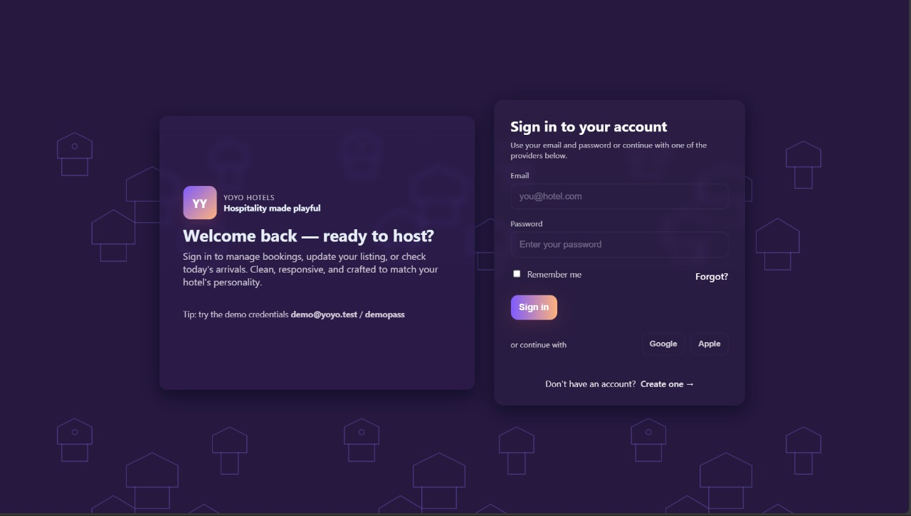
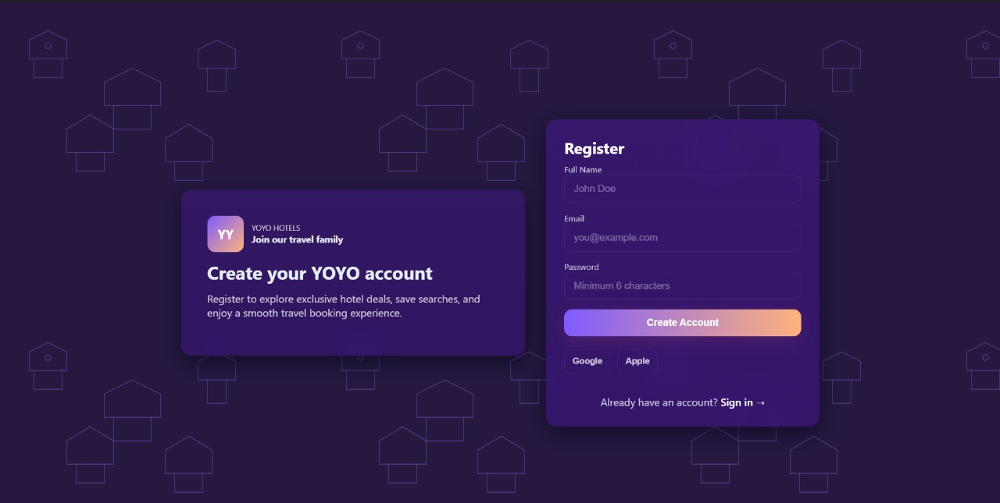
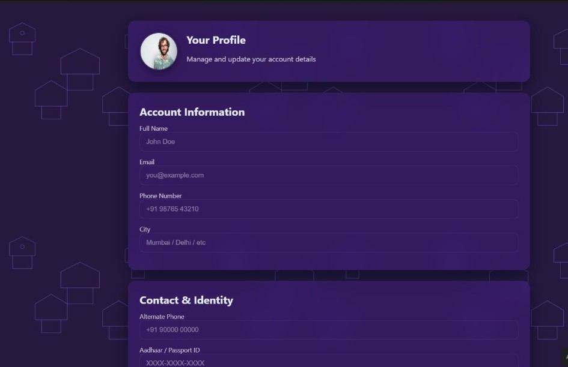
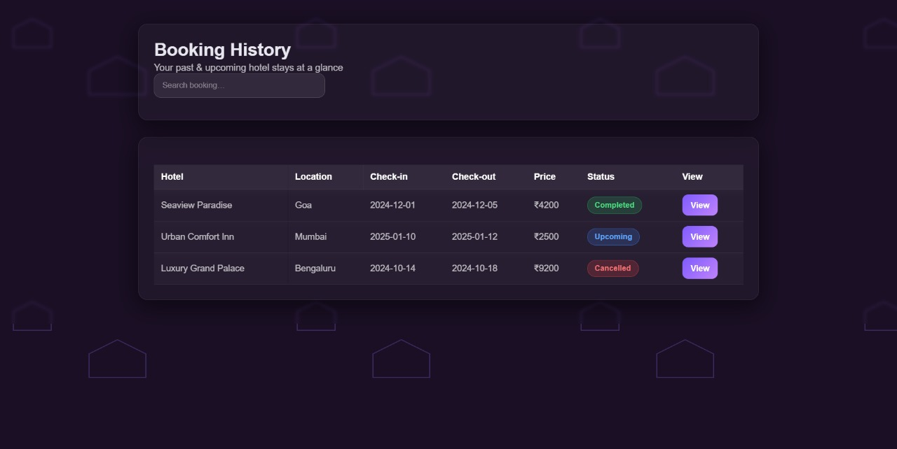
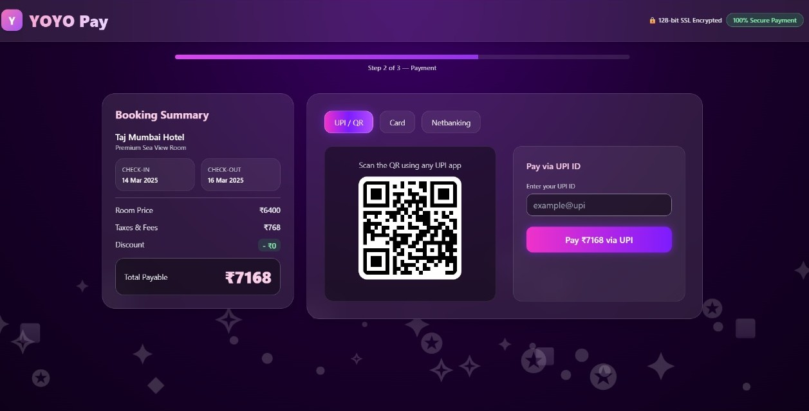

# Hotel Management System

A full-stack **Hotel Management System** designed to manage hotel bookings, room availability,
customers, and administrative operations through a user-friendly web interface.


## Project Overview
This project provides a complete solution for hotel operations including user registration,
room booking, payment processing, and profile management.  
It supports both **user** and **admin** workflows with structured data handling.

---

## Features
- User authentication (Sign up / Sign in)
- Room booking and booking history
- Secure payment processing
- User profile management
- Admin-side management and monitoring

---

##  Technologies Used
- **Frontend:** HTML, CSS, JavaScript
- **Backend:** Django / Flask / Node.js
- **Database:** MySQL
- **Version Control:** Git & GitHub


---

## 📸 Application Screenshots

### Sign In Page


### User Registration


###  Home Page


###  User Profile


###  Booking History


### Payment Page


---

## 🚀 How to Run the Project
1. Clone the repository  
   ```bash
   git clone https://github.com/Sharon-droid99/Hotel-Management-System.git

